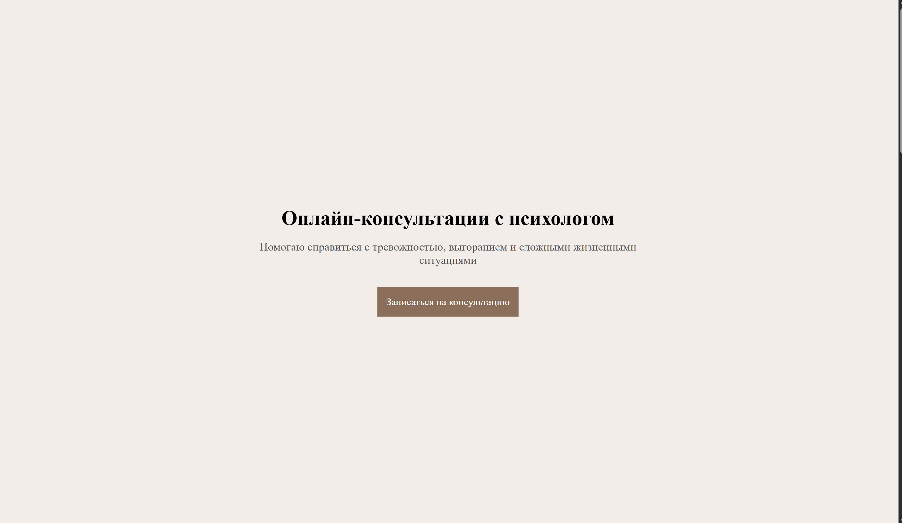
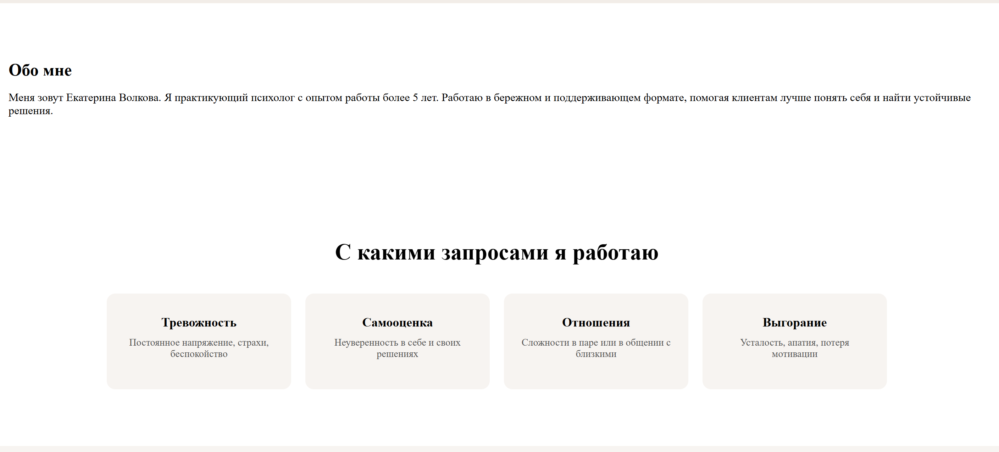
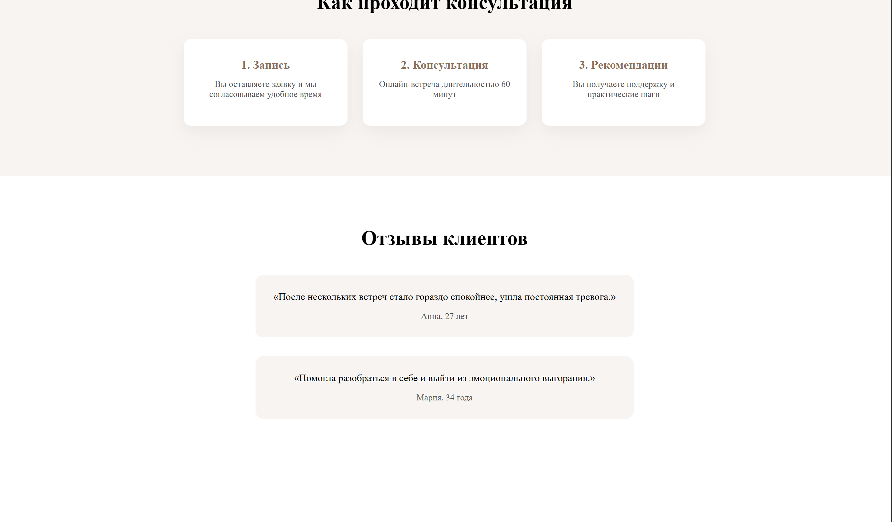

# Лендинг для онлайн-психолога

## Задача
Создать одностраничный сайт для онлайн-консультаций, который вызывает доверие и приводит к заявкам с мобильных устройств.

## Решение
Разработан адаптивный лендинг с чёткой структурой:
- первый экран с призывом к действию
- блок доверия и отзывы
- карточки с услугами
- форма записи

## Технологии
- HTML5
- CSS3
- Flexbox
- Адаптивная верстка

## Результат

## Демо сайта
Демо:  https://llesia-solny.github.io/psychologist-landing/
